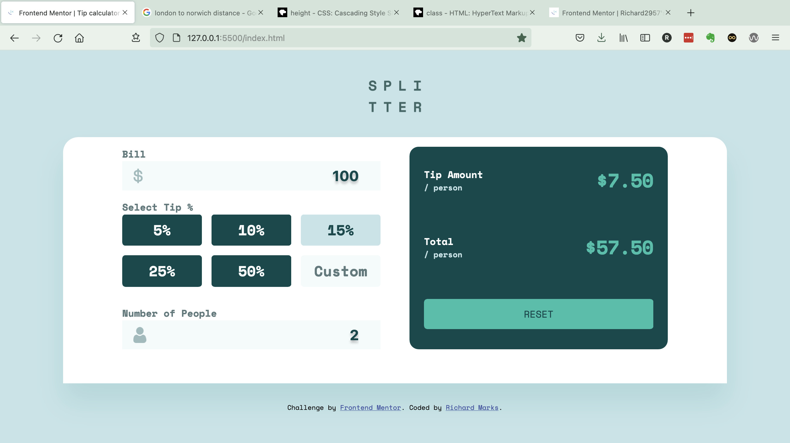

# Frontend Mentor - Tip calculator app solution

This is a solution to the [Tip calculator app challenge on Frontend Mentor](https://www.frontendmentor.io/challenges/tip-calculator-app-ugJNGbJUX). Frontend Mentor challenges help you improve your coding skills by building realistic projects.

## Table of contents

  - [The challenge](#the-challenge)
  - [Screenshot](#screenshot)
  - [Links](#links)
- [My process](#my-process)
  - [Built with](#built-with)
  - [What I learned](#what-i-learned)

- [Author](#author)

### The challenge

Users should be able to:

- View the optimal layout for the app depending on their device's screen size
- See hover states for all interactive elements on the page
- Calculate the correct tip and total cost of the bill per person

### Screenshot

### Links

- Solution URL: [https://github.com/Richard2957/tip-calculator-app-main](https://github.com/Richard2957/tip-calculator-app-main)
- Live Site URL: [https://richard2957.github.io/tip-calculator-app-main/](https://richard2957.github.io/tip-calculator-app-main/)

## My process

### Built with

- Semantic HTML5 markup
- CSS custom properties
- Flexbox
- Vanilla Javascript

### What I learned
Lots to do in this project which took me all day. Got stuck with two things. Getting the Custom Percentage box was fiddly but where I really got stuck was with dealing with the event handlers bubbling from the inout box to the button and giving a runtime error. Kludged this by just adding a try{} finally{}.
Also getting the $ icon (wot no £) and the People icon to display in the right place was also very tricky, finally stumbled across the vertical-align property.

## Author

- Frontend Mentor - [@yourusername](https://www.frontendmentor.io/profile/Richard2957)
- Twitter - [@Richard2957](https://www.twitter.com/Richard2957)

